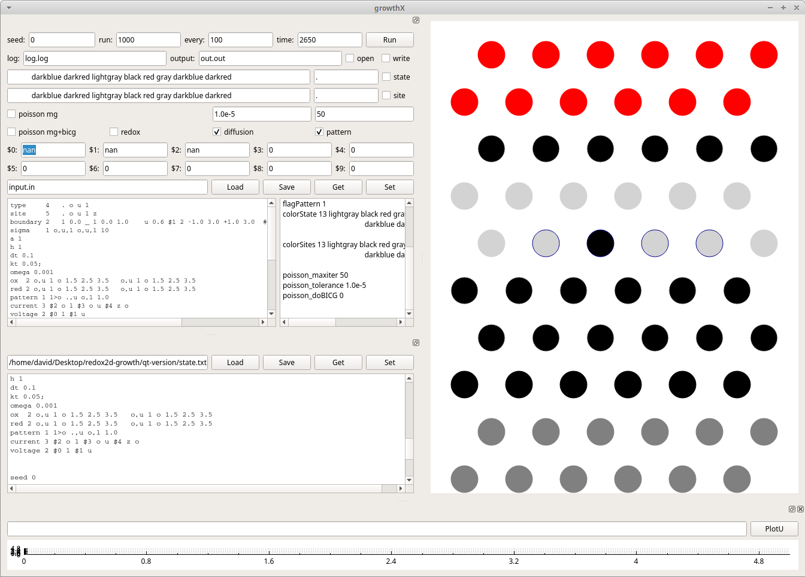

# redox2d-growth
Growth simulator for 2d hexagonal redox system with hexa multigrid.


Growth simulation of resistive memristors:

https://www.youtube.com/watch?v=W9CEvGQ-yew

https://www.youtube.com/watch?v=DWqTSSCZ8GM

Basic theory: https://media.nature.com/original/nature-assets/srep/2016/160804/srep30775/extref/srep30775-s1.pdf

However this is a generalization of what is written there to handle general growth porblem driven by diffusion and possison equation. If you want to level up I am happy to help, contact me.

To solve Hexagonal MULTI GRID efficiently use the grid sizes listed in the grid-efficient-possion.pdf file.

Input and the grid should be given as:
```
state 6 12
 u u u u u u 
u u u u u u 
 o o o o o o
. . . . . . 
 o o o o o o
. . . . . . 
 . . o . . . 
o o o o o o 
 o o o o o o 
o o o o o o 
 l l l l l l 
l l l l l l 

sites 6 12
 u u u u u u 
u u u u u u 
 . . . . . .
. . . . . . 
 . . . . . .
. . . . . . 
 . z z z z . 
. . . . . . 
 . . . . . . 
o o o o o o 
 l l l l l l 
l l l l l l 


-----------------
type         13   .    o    +    -   *   a   x    y     z     u    b    l    r   
site         13   .    o    +    -   *   a   x    y     z     u    b    l    r    
----------------
a            7.27           (a0)
h            5.0
dt           0.1
kT           0.001          (0.000918733=25meV)  (1eV = 0.03674932 E_h  (hartrees))
----------------
boundary     2   l 0.0 _ 1 0.0 1.0    u 0.0 _ 1 -0.01 1.0           # u 0.6 $1 2 -0.03 3.0 +0.03.0 3.0  # R var numof ui dti ...       
sigma        1 o,u,l o,u,l 10
er           1 o,u,l o,u,l 1
omega        0.001
current      2 $2 . l $3 . u 
voltage      2 $0 l   $1 u
----------------
charge       1   +    1.0      
tau          3   .    0.0        o    10.0        x,u,l         1.0e20      
gamma1st     3   + +  0.003      + o  0.003      o,u,l o,u,l   -0.006           
gamma2nd     1   + +  0.0       
barrier      2   . +  0.0    o o 10000    
----------------
red          1 o       + o   0.0 0.03  0.0
ox           1 +,.,-   o +   0.0 0.03  1000.0
----------------
seed          0
flagPoisson   1
flagDiffusion 1
flagRedox     1
flagPattern   0

time   0
run    1000
every  10

colorState 13 lightgray black red yellow gray gray darkgreen gray gray darkblue green darkred green  
colorSites 13 lightgray black red yellow gray gray darkgreen gray gray darkblue green darkred green  
```

### CMD-VERSION Usage:

> ./rdx2dg input.inp output.out -state state.txt -sites state.txt 

To plot use:

> mkdir pngs
> python plot_output.py

### QT-Version:

Load or copy-paste the state.txt from the ./qt-version/state.txt to state as well as input.




